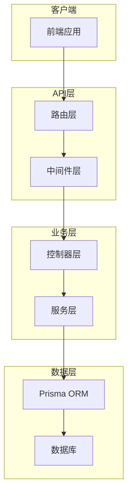

# 后端架构详细说明文档

## 架构概览

后端采用Node.js + Express + TypeScript + Prisma的现代化技术栈，遵循分层架构设计，实现了高性能、可扩展、易维护的RESTful API服务。

## 技术栈详情

### 核心框架
- **Node.js**: JavaScript运行时环境
- **Express 5.1.0**: 快速、极简的Web框架
- **TypeScript 5.9.2**: JavaScript超集，提供静态类型检查

### 数据库与ORM
- **Prisma 6.14.0**: 现代化数据库ORM，提供类型安全的数据库访问
- **SQLite3 5.1.7**: 轻量级关系型数据库（开发环境）
- **PostgreSQL**: 生产环境推荐数据库

### 认证与安全
- **JWT 9.0.2**: JSON Web Token，用于用户认证
- **bcryptjs 3.0.2**: 密码哈希库
- **CORS 2.8.5**: 跨域资源共享中间件
- **body-parser 2.2.0**: 请求体解析中间件

### 开发工具
- **ts-node 10.9.2**: TypeScript直接执行工具
- **nodemon 3.0.0**: 开发时自动重启工具
- **dotenv 17.2.1**: 环境变量管理

## 目录结构详解

```
server/
├── src/
│   ├── controllers/           # 控制器层
│   │   ├── authController.ts  # 认证控制器
│   │   ├── userController.ts  # 用户控制器
│   │   ├── courseController.ts # 课程控制器
│   │   ├── resourceController.ts # 资源控制器
│   │   └── communityController.ts # 社区控制器
│   ├── routes/                # 路由层
│   │   ├── userRoutes.ts      # 用户路由
│   │   ├── courseRoutes.ts    # 课程路由
│   │   ├── resourceRoutes.ts  # 资源路由
│   │   └── communityRoutes.ts # 社区路由
│   ├── services/              # 业务逻辑层
│   │   ├── authService.ts     # 认证服务
│   │   ├── userService.ts     # 用户服务
│   │   ├── courseService.ts   # 课程服务
│   │   ├── resourceService.ts # 资源服务
│   │   ├── communityService.ts # 社区服务
│   │   └── aiService.ts       # AI服务
│   ├── middleware/            # 中间件
│   │   ├── auth.ts            # 认证中间件
│   │   ├── validation.ts      # 数据验证中间件
│   │   ├── errorHandler.ts    # 错误处理中间件
│   │   └── logger.ts          # 日志中间件
│   ├── models/                # 数据模型
│   │   └── index.ts           # 模型导出
│   └── utils/                 # 工具函数
│       ├── jwt.ts             # JWT工具
│       ├── validation.ts      # 验证工具
│       └── response.ts        # 响应工具
├── prisma/
│   ├── schema.prisma          # 数据库模式定义
│   ├── migrations/            # 数据库迁移文件
│   └── seed.ts                # 数据库种子数据
├── config/
│   ├── database.ts            # 数据库配置
│   ├── environment.ts         # 环境配置
│   └── constants.ts           # 常量定义
├── scripts/
│   ├── seed.ts                # 数据库种子脚本
│   ├── migrate.ts             # 迁移脚本
│   └── build.ts               # 构建脚本
├── generated/
│   └── prisma/                # Prisma客户端生成目录
├── data/
│   ├── courses.json           # 课程数据
│   ├── resources.json         # 资源数据
│   └── users.json             # 用户数据
├── server.ts                  # 应用入口文件
├── tsconfig.json              # TypeScript配置
├── package.json               # 项目依赖
├── .env.example               # 环境变量示例
└── .env                       # 环境变量配置
```

## 核心架构设计

### 1. 分层架构



#### 层次职责
- **路由层**: 定义API端点，处理HTTP请求路由
- **中间件层**: 处理通用逻辑（认证、验证、日志、错误处理）
- **控制器层**: 协调服务层，处理请求和响应
- **服务层**: 实现业务逻辑，数据操作和外部服务调用
- **数据层**: 数据库访问和持久化

### 2. Express应用配置

```typescript
// server.ts
import express from 'express'
import cors from 'cors'
import bodyParser from 'body-parser'
import dotenv from 'dotenv'
import { errorHandler } from './src/middleware/errorHandler'
import { logger } from './src/middleware/logger'

dotenv.config()

const app = express()
const PORT = process.env.PORT || 3000

// 基础中间件
app.use(cors({
  origin: process.env.CORS_ORIGIN || 'http://localhost:5173',
  credentials: true
}))
app.use(bodyParser.json({ limit: '10mb' }))
app.use(bodyParser.urlencoded({ extended: true, limit: '10mb' }))

// 日志中间件
app.use(logger)

// 路由注册
app.use('/api/user', require('./src/routes/userRoutes'))
app.use('/api/community', require('./src/routes/communityRoutes'))
app.use('/api/resources', require('./src/routes/resourceRoutes'))
app.use('/api/courses', require('./src/routes/courseRoutes'))

// 健康检查
app.get('/api/health', (_req, res) => {
  res.json({ success: true, message: 'Server is running' })
})

// 错误处理中间件
app.use(errorHandler)

app.listen(PORT, () => {
  console.log(`Server running at http://localhost:${PORT}`)
})
```

### 3. 数据库配置

```typescript
// config/database.ts
import { PrismaClient } from '@prisma/client'

declare global {
  var __prisma: PrismaClient | undefined
}

// 开发环境避免热重载创建多个实例
const prisma = globalThis.__prisma || new PrismaClient({
  log: process.env.NODE_ENV === 'development' ? ['query', 'error', 'warn'] : ['error'],
  errorFormat: 'pretty'
})

if (process.env.NODE_ENV === 'development') {
  globalThis.__prisma = prisma
}

export { prisma }

// 数据库连接测试
export const connectDatabase = async (): Promise<void> => {
  try {
    await prisma.$connect()
    console.log('✅ Database connected successfully')
  } catch (error) {
    console.error('❌ Database connection failed:', error)
    process.exit(1)
  }
}

// 优雅关闭数据库连接
export const disconnectDatabase = async (): Promise<void> => {
  await prisma.$disconnect()
  console.log('📴 Database disconnected')
}
```

### 4. 认证中间件

```typescript
// middleware/auth.ts
import { Request, Response, NextFunction } from 'express'
import jwt from 'jsonwebtoken'
import { prisma } from '../config/database'

interface AuthRequest extends Request {
  user?: {
    id: string
    username: string
    email: string
    role: string
  }
}

export const authenticateToken = async (
  req: AuthRequest,
  res: Response,
  next: NextFunction
): Promise<void> => {
  try {
    const authHeader = req.headers.authorization
    const token = authHeader && authHeader.split(' ')[1]

    if (!token) {
      res.status(401).json({ success: false, message: 'Access token required' })
      return
    }

    const decoded = jwt.verify(token, process.env.JWT_SECRET!) as any
    const user = await prisma.user.findUnique({
      where: { id: decoded.userId },
      select: { id: true, username: true, email: true, role: true }
    })

    if (!user) {
      res.status(401).json({ success: false, message: 'Invalid token' })
      return
    }

    req.user = user
    next()
  } catch (error) {
    res.status(401).json({ success: false, message: 'Invalid token' })
  }
}

export const requireRole = (roles: string[]) => {
  return (req: AuthRequest, res: Response, next: NextFunction): void => {
    if (!req.user) {
      res.status(401).json({ success: false, message: 'Authentication required' })
      return
    }

    if (!roles.includes(req.user.role)) {
      res.status(403).json({ success: false, message: 'Insufficient permissions' })
      return
    }

    next()
  }
}
```

### 5. 服务层设计

```typescript
// services/userService.ts
import { prisma } from '../config/database'
import bcrypt from 'bcryptjs'
import jwt from 'jsonwebtoken'
import { User, UserPreferences } from '@prisma/client'

export interface CreateUserInput {
  username: string
  email: string
  password: string
  bio?: string
  avatar?: string
}

export interface UpdateUserInput {
  username?: string
  bio?: string
  avatar?: string
}

export class UserService {
  async createUser(userData: CreateUserInput): Promise<{ user: Omit<User, 'password'>, token: string }> {
    // 检查用户名和邮箱是否已存在
    const existingUser = await prisma.user.findFirst({
      where: {
        OR: [
          { username: userData.username },
          { email: userData.email }
        ]
      }
    })

    if (existingUser) {
      throw new Error('Username or email already exists')
    }

    // 密码加密
    const hashedPassword = await bcrypt.hash(userData.password, 12)

    // 创建用户
    const user = await prisma.user.create({
      data: {
        ...userData,
        password: hashedPassword,
        userPreferences: {
          create: {
            theme: 'dark',
            codePanelRatio: 50,
            language: 'javascript',
            notifications: true
          }
        }
      },
      include: {
        userPreferences: true
      }
    })

    // 生成JWT令牌
    const token = jwt.sign(
      { userId: user.id },
      process.env.JWT_SECRET!,
      { expiresIn: '7d' }
    )

    // 返回用户信息（不包含密码）
    const { password, ...userWithoutPassword } = user
    return { user: userWithoutPassword, token }
  }

  async authenticateUser(email: string, password: string): Promise<{ user: Omit<User, 'password'>, token: string }> {
    const user = await prisma.user.findUnique({
      where: { email },
      include: { userPreferences: true }
    })

    if (!user) {
      throw new Error('Invalid credentials')
    }

    const isValidPassword = await bcrypt.compare(password, user.password)
    if (!isValidPassword) {
      throw new Error('Invalid credentials')
    }

    // 更新最后登录时间
    await prisma.user.update({
      where: { id: user.id },
      data: { lastLoginAt: new Date() }
    })

    const token = jwt.sign(
      { userId: user.id },
      process.env.JWT_SECRET!,
      { expiresIn: '7d' }
    )

    const { password: _, ...userWithoutPassword } = user
    return { user: userWithoutPassword, token }
  }

  async getUserById(userId: string): Promise<Omit<User, 'password'> | null> {
    const user = await prisma.user.findUnique({
      where: { id: userId },
      include: { userPreferences: true }
    })

    if (!user) return null

    const { password, ...userWithoutPassword } = user
    return userWithoutPassword
  }

  async updateUser(userId: string, updateData: UpdateUserInput): Promise<Omit<User, 'password'>> {
    const user = await prisma.user.update({
      where: { id: userId },
      data: updateData,
      include: { userPreferences: true }
    })

    const { password, ...userWithoutPassword } = user
    return userWithoutPassword
  }

  async deleteUser(userId: string): Promise<void> {
    await prisma.user.delete({
      where: { id: userId }
    })
  }
}

export const userService = new UserService()
```

### 6. AI服务集成

```typescript
// services/aiService.ts
import axios, { AxiosResponse } from 'axios'

export interface ChatMessage {
  role: 'user' | 'assistant' | 'system'
  content: string
}

export interface ChatContext {
  messages: ChatMessage[]
  model?: string
  temperature?: number
  maxTokens?: number
}

export interface AIResponse {
  content: string
  usage?: {
    promptTokens: number
    completionTokens: number
    totalTokens: number
  }
}

export interface AIStreamChunk {
  content?: string
  delta?: string
  finished?: boolean
  usage?: any
}

export abstract class BaseAIService {
  protected apiKey: string
  protected baseURL: string
  protected model: string

  constructor(apiKey: string, baseURL: string, model: string) {
    this.apiKey = apiKey
    this.baseURL = baseURL
    this.model = model
  }

  abstract sendMessage(message: string, context?: ChatContext): Promise<AIResponse>
  abstract sendStreamMessage(message: string, context?: ChatContext): Promise<ReadableStream<AIStreamChunk>>
}

export class DeepSeekService extends BaseAIService {
  constructor(apiKey: string) {
    super(apiKey, 'https://api.deepseek.com/v1', 'deepseek-chat')
  }

  async sendMessage(message: string, context?: ChatContext): Promise<AIResponse> {
    const messages = [
      ...(context?.messages || []),
      { role: 'user' as const, content: message }
    ]

    try {
      const response: AxiosResponse = await axios.post(
        `${this.baseURL}/chat/completions`,
        {
          model: this.model,
          messages,
          temperature: context?.temperature || 0.7,
          max_tokens: context?.maxTokens || 2000
        },
        {
          headers: {
            'Authorization': `Bearer ${this.apiKey}`,
            'Content-Type': 'application/json'
          }
        }
      )

      return {
        content: response.data.choices[0].message.content,
        usage: response.data.usage
      }
    } catch (error: any) {
      throw new Error(`DeepSeek API error: ${error.response?.data?.error?.message || error.message}`)
    }
  }

  async sendStreamMessage(message: string, context?: ChatContext): Promise<ReadableStream<AIStreamChunk>> {
    const messages = [
      ...(context?.messages || []),
      { role: 'user' as const, content: message }
    ]

    const response = await fetch(`${this.baseURL}/chat/completions`, {
      method: 'POST',
      headers: {
        'Authorization': `Bearer ${this.apiKey}`,
        'Content-Type': 'application/json'
      },
      body: JSON.stringify({
        model: this.model,
        messages,
        temperature: context?.temperature || 0.7,
        max_tokens: context?.maxTokens || 2000,
        stream: true
      })
    })

    if (!response.ok) {
      throw new Error(`DeepSeek API error: ${response.statusText}`)
    }

    return new ReadableStream({
      async start(controller) {
        const reader = response.body?.getReader()
        const decoder = new TextDecoder()

        if (!reader) {
          controller.close()
          return
        }

        try {
          while (true) {
            const { done, value } = await reader.read()
            if (done) break

            const chunk = decoder.decode(value, { stream: true })
            const lines = chunk.split('\n')

            for (const line of lines) {
              if (line.startsWith('data: ')) {
                const data = line.slice(6)
                if (data === '[DONE]') {
                  controller.enqueue({ finished: true })
                  break
                }

                try {
                  const parsed = JSON.parse(data)
                  const delta = parsed.choices[0]?.delta?.content
                  if (delta) {
                    controller.enqueue({ content: delta, delta })
                  }
                } catch (e) {
                  // 忽略解析错误
                }
              }
            }
          }
        } finally {
          reader.releaseLock()
          controller.close()
        }
      }
    })
  }
}

// AI服务工厂
export class AIServiceFactory {
  private services: Map<string, BaseAIService> = new Map()

  constructor() {
    // 初始化可用的AI服务
    if (process.env.DEEPSEEK_API_KEY) {
      this.services.set('deepseek', new DeepSeekService(process.env.DEEPSEEK_API_KEY))
    }
    
    // 可以添加更多AI服务
    // if (process.env.KIMI_API_KEY) {
    //   this.services.set('kimi', new KimiService(process.env.KIMI_API_KEY))
    // }
  }

  getService(name: string): BaseAIService | undefined {
    return this.services.get(name)
  }

  getAvailableServices(): string[] {
    return Array.from(this.services.keys())
  }
}

export const aiServiceFactory = new AIServiceFactory()
```

### 7. 错误处理机制

```typescript
// middleware/errorHandler.ts
import { Request, Response, NextFunction } from 'express'

export class AppError extends Error {
  public statusCode: number
  public isOperational: boolean

  constructor(message: string, statusCode: number) {
    super(message)
    this.statusCode = statusCode
    this.isOperational = true

    Error.captureStackTrace(this, this.constructor)
  }
}

export const errorHandler = (
  err: Error,
  req: Request,
  res: Response,
  next: NextFunction
): void => {
  let error = { ...err }
  error.message = err.message

  // 记录错误日志
  console.error('Error:', err)

  // Prisma错误处理
  if (err.name === 'PrismaClientKnownRequestError') {
    const message = 'Database operation failed'
    error = new AppError(message, 400)
  }

  // JWT错误处理
  if (err.name === 'JsonWebTokenError') {
    const message = 'Invalid token'
    error = new AppError(message, 401)
  }

  // JWT过期错误
  if (err.name === 'TokenExpiredError') {
    const message = 'Token expired'
    error = new AppError(message, 401)
  }

  // 验证错误
  if (err.name === 'ValidationError') {
    const message = 'Validation failed'
    error = new AppError(message, 400)
  }

  res.status(error.statusCode || 500).json({
    success: false,
    message: error.message || 'Internal Server Error',
    ...(process.env.NODE_ENV === 'development' && { stack: err.stack })
  })
}

// 异步错误捕获包装器
export const catchAsync = (fn: Function) => {
  return (req: Request, res: Response, next: NextFunction) => {
    Promise.resolve(fn(req, res, next)).catch(next)
  }
}
```

### 8. 数据验证中间件

```typescript
// middleware/validation.ts
import { Request, Response, NextFunction } from 'express'
import { z, ZodSchema } from 'zod'

export const validate = (schema: ZodSchema) => {
  return (req: Request, res: Response, next: NextFunction): void => {
    try {
      schema.parse(req.body)
      next()
    } catch (error: any) {
      if (error instanceof z.ZodError) {
        const errorMessage = error.errors.map(err => err.message).join(', ')
        res.status(400).json({
          success: false,
          message: 'Validation failed',
          errors: error.errors
        })
      } else {
        next(error)
      }
    }
  }
}

// 验证模式定义
export const userRegistrationSchema = z.object({
  username: z.string().min(3).max(20),
  email: z.string().email(),
  password: z.string().min(6)
})

export const userLoginSchema = z.object({
  email: z.string().email(),
  password: z.string().min(1)
})

export const discussionSchema = z.object({
  title: z.string().min(1).max(200),
  content: z.string().min(1),
  category: z.enum(['TECH', 'EXPERIENCE', 'PROJECT', 'HELP'])
})
```

## 性能优化策略

### 1. 数据库优化

```typescript
// 查询优化示例
export class OptimizedUserService {
  // 使用select减少数据传输
  async getUserProfile(userId: string) {
    return await prisma.user.findUnique({
      where: { id: userId },
      select: {
        id: true,
        username: true,
        email: true,
        bio: true,
        avatar: true,
        createdAt: true,
        userPreferences: {
          select: {
            theme: true,
            language: true,
            notifications: true
          }
        }
      }
    })
  }

  // 批量操作优化
  async getUsersByIds(userIds: string[]) {
    return await prisma.user.findMany({
      where: { id: { in: userIds } },
      select: {
        id: true,
        username: true,
        avatar: true
      }
    })
  }

  // 分页查询优化
  async getDiscussions(page: number, limit: number, category?: string) {
    const skip = (page - 1) * limit
    
    const where = category ? { category } : {}
    
    const [discussions, total] = await Promise.all([
      prisma.discussion.findMany({
        where,
        skip,
        take: limit,
        include: {
          author: {
            select: { id: true, username: true, avatar: true }
          },
          _count: {
            select: { comments: true }
          }
        },
        orderBy: { createdAt: 'desc' }
      }),
      prisma.discussion.count({ where })
    ])

    return {
      discussions,
      pagination: {
        page,
        limit,
        total,
        totalPages: Math.ceil(total / limit)
      }
    }
  }
}
```

### 2. 缓存策略

```typescript
// utils/cache.ts
import NodeCache from 'node-cache'

class CacheService {
  private cache: NodeCache

  constructor() {
    this.cache = new NodeCache({
      stdTTL: 300, // 5分钟默认过期时间
      checkperiod: 60 // 每分钟检查过期键
    })
  }

  set<T>(key: string, value: T, ttl?: number): void {
    this.cache.set(key, value, ttl)
  }

  get<T>(key: string): T | undefined {
    return this.cache.get<T>(key)
  }

  del(key: string): void {
    this.cache.del(key)
  }

  flush(): void {
    this.cache.flushAll()
  }

  // 装饰器缓存
  cacheResult(ttl: number = 300) {
    return (target: any, propertyName: string, descriptor: PropertyDescriptor) => {
      const method = descriptor.value

      descriptor.value = async function (...args: any[]) {
        const cacheKey = `${propertyName}:${JSON.stringify(args)}`
        
        let result = this.cache?.get(cacheKey)
        if (result) {
          return result
        }

        result = await method.apply(this, args)
        this.cache?.set(cacheKey, result, ttl)
        
        return result
      }
    }
  }
}

export const cacheService = new CacheService()
```

### 3. 连接池管理

```typescript
// config/database.ts
import { PrismaClient } from '@prisma/client'

export class DatabaseManager {
  private static instance: PrismaClient
  private static isConnected = false

  public static getInstance(): PrismaClient {
    if (!DatabaseManager.instance) {
      DatabaseManager.instance = new PrismaClient({
        datasources: {
          db: {
            url: process.env.DATABASE_URL
          }
        },
        log: process.env.NODE_ENV === 'development' ? ['query', 'error'] : ['error']
      })
    }
    return DatabaseManager.instance
  }

  public static async connect(): Promise<void> {
    if (DatabaseManager.isConnected) return

    try {
      await DatabaseManager.getInstance().$connect()
      DatabaseManager.isConnected = true
      console.log('✅ Database connected')
    } catch (error) {
      console.error('❌ Database connection failed:', error)
      throw error
    }
  }

  public static async disconnect(): Promise<void> {
    if (!DatabaseManager.isConnected) return

    await DatabaseManager.getInstance().$disconnect()
    DatabaseManager.isConnected = false
    console.log('📴 Database disconnected')
  }
}
```

## 测试策略

### 1. 单元测试

```typescript
// tests/services/userService.test.ts
import { describe, it, expect, beforeEach, afterEach } from '@jest/globals'
import { prisma } from '../../config/database'
import { userService } from '../../services/userService'

describe('UserService', () => {
  beforeEach(async () => {
    // 清理测试数据
    await prisma.user.deleteMany()
  })

  afterEach(async () => {
    // 清理测试数据
    await prisma.user.deleteMany()
  })

  describe('createUser', () => {
    it('should create a new user successfully', async () => {
      const userData = {
        username: 'testuser',
        email: 'test@example.com',
        password: 'password123'
      }

      const result = await userService.createUser(userData)

      expect(result.user.username).toBe(userData.username)
      expect(result.user.email).toBe(userData.email)
      expect(result.user.password).toBeUndefined()
      expect(result.token).toBeDefined()
    })

    it('should throw error if username already exists', async () => {
      const userData = {
        username: 'testuser',
        email: 'test@example.com',
        password: 'password123'
      }

      await userService.createUser(userData)

      await expect(userService.createUser({
        ...userData,
        email: 'test2@example.com'
      })).rejects.toThrow('Username or email already exists')
    })
  })
})
```

### 2. 集成测试

```typescript
// tests/integration/auth.test.ts
import request from 'supertest'
import { app } from '../../server'

describe('Auth Integration Tests', () => {
  describe('POST /api/user/register', () => {
    it('should register a new user', async () => {
      const userData = {
        username: 'testuser',
        email: 'test@example.com',
        password: 'password123'
      }

      const response = await request(app)
        .post('/api/user/register')
        .send(userData)
        .expect(201)

      expect(response.body.success).toBe(true)
      expect(response.body.data.user.username).toBe(userData.username)
      expect(response.body.data.token).toBeDefined()
    })
  })

  describe('POST /api/user/login', () => {
    it('should login with valid credentials', async () => {
      // 先注册用户
      const userData = {
        username: 'testuser',
        email: 'test@example.com',
        password: 'password123'
      }

      await request(app)
        .post('/api/user/register')
        .send(userData)

      // 登录
      const response = await request(app)
        .post('/api/user/login')
        .send({
          email: userData.email,
          password: userData.password
        })
        .expect(200)

      expect(response.body.success).toBe(true)
      expect(response.body.data.token).toBeDefined()
    })
  })
})
```

## 部署配置

### 1. 环境配置

```typescript
// config/environment.ts
export const config = {
  port: process.env.PORT || 3000,
  nodeEnv: process.env.NODE_ENV || 'development',
  jwtSecret: process.env.JWT_SECRET || 'fallback-secret',
  jwtExpiresIn: process.env.JWT_EXPIRES_IN || '7d',
  databaseUrl: process.env.DATABASE_URL || 'file:./prisma/dev.db',
  corsOrigin: process.env.CORS_ORIGIN || 'http://localhost:5173',
  
  // AI服务配置
  deepseek: {
    apiKey: process.env.DEEPSEEK_API_KEY,
    baseURL: process.env.DEEPSEEK_API_BASE || 'https://api.deepseek.com/v1'
  },
  
  kimi: {
    apiKey: process.env.KIMI_API_KEY,
    baseURL: process.env.KIMI_API_BASE || 'https://api.moonshot.cn/v1'
  },
  
  coze: {
    apiKey: process.env.COZE_API_KEY,
    baseURL: process.env.COZE_API_BASE || 'https://api.coze.cn/v1'
  }
}

// 验证必需的环境变量
export const validateConfig = (): void => {
  const requiredVars = ['JWT_SECRET']
  
  for (const varName of requiredVars) {
    if (!process.env[varName]) {
      throw new Error(`Required environment variable ${varName} is missing`)
    }
  }
}
```

### 2. 生产环境配置

```json
{
  "name": "ai-learning-platform-server",
  "version": "1.0.0",
  "scripts": {
    "start": "node dist/server.js",
    "build": "tsc -p tsconfig.json",
    "dev": "ts-node server.ts",
    "test": "jest",
    "lint": "eslint . --ext .ts --fix"
  },
  "dependencies": {
    "express": "^5.1.0",
    "@prisma/client": "^6.14.0",
    "jsonwebtoken": "^9.0.2",
    "bcryptjs": "^3.0.2",
    "cors": "^2.8.5",
    "dotenv": "^17.2.1"
  },
  "devDependencies": {
    "@types/node": "^24.3.0",
    "typescript": "^5.9.2",
    "ts-node": "^10.9.2",
    "nodemon": "^3.0.0",
    "jest": "^29.0.0",
    "@types/jest": "^29.0.0"
  }
}
```

## 监控与日志

### 1. 日志系统

```typescript
// middleware/logger.ts
import { Request, Response, NextFunction } from 'express'
import fs from 'fs'
import path from 'path'

export const logger = (req: Request, res: Response, next: NextFunction): void => {
  const start = Date.now()
  const { method, url, ip } = req
  const userAgent = req.get('User-Agent') || ''

  // 记录请求开始
  const logEntry = {
    timestamp: new Date().toISOString(),
    method,
    url,
    ip,
    userAgent,
    contentLength: req.get('Content-Length') || 0
  }

  // 监听响应结束
  res.on('finish', () => {
    const duration = Date.now() - start
    const { statusCode } = res
    
    const responseLog = {
      ...logEntry,
      statusCode,
      duration: `${duration}ms`,
      contentLength: res.get('Content-Length') || 0
    }

    // 写入日志文件
    writeLog(responseLog)
    
    // 控制台输出
    console.log(`${method} ${url} ${statusCode} - ${duration}ms`)
  })

  next()
}

const writeLog = (logEntry: any): void => {
  const logDir = path.join(process.cwd(), 'logs')
  const logFile = path.join(logDir, `access-${new Date().toISOString().split('T')[0]}.log`)
  
  // 确保日志目录存在
  if (!fs.existsSync(logDir)) {
    fs.mkdirSync(logDir, { recursive: true })
  }
  
  fs.appendFileSync(logFile, JSON.stringify(logEntry) + '\n')
}
```

### 2. 健康检查

```typescript
// routes/health.ts
import { Router } from 'express'
import { prisma } from '../config/database'

const router = Router()

router.get('/health', async (req, res) => {
  try {
    // 检查数据库连接
    await prisma.$queryRaw`SELECT 1`
    
    // 检查内存使用
    const memUsage = process.memoryUsage()
    
    // 检查运行时间
    const uptime = process.uptime()
    
    res.json({
      status: 'healthy',
      timestamp: new Date().toISOString(),
      uptime: `${Math.floor(uptime / 60)}m ${Math.floor(uptime % 60)}s`,
      memory: {
        rss: `${Math.round(memUsage.rss / 1024 / 1024)}MB`,
        heapUsed: `${Math.round(memUsage.heapUsed / 1024 / 1024)}MB`,
        heapTotal: `${Math.round(memUsage.heapTotal / 1024 / 1024)}MB`
      },
      database: 'connected'
    })
  } catch (error) {
    res.status(503).json({
      status: 'unhealthy',
      timestamp: new Date().toISOString(),
      error: error instanceof Error ? error.message : 'Unknown error'
    })
  }
})

export default router
```

## 最佳实践

### 1. 代码规范
- 使用TypeScript严格模式
- 遵循RESTful API设计原则
- 统一的错误处理机制
- 完善的类型定义和注释

### 2. 安全考虑
- JWT令牌安全存储和验证
- 密码加密存储
- 输入数据验证和清理
- SQL注入防护
- CORS配置

### 3. 性能优化
- 数据库查询优化
- 连接池管理
- 缓存策略
- 响应压缩
- 分页查询

### 4. 可维护性
- 模块化设计
- 依赖注入
- 配置管理
- 日志记录
- 测试覆盖

---

**文档版本**: v1.0.0  
**最后更新**: 2026-01-06  
**维护团队**: AI Learning Platform Team
