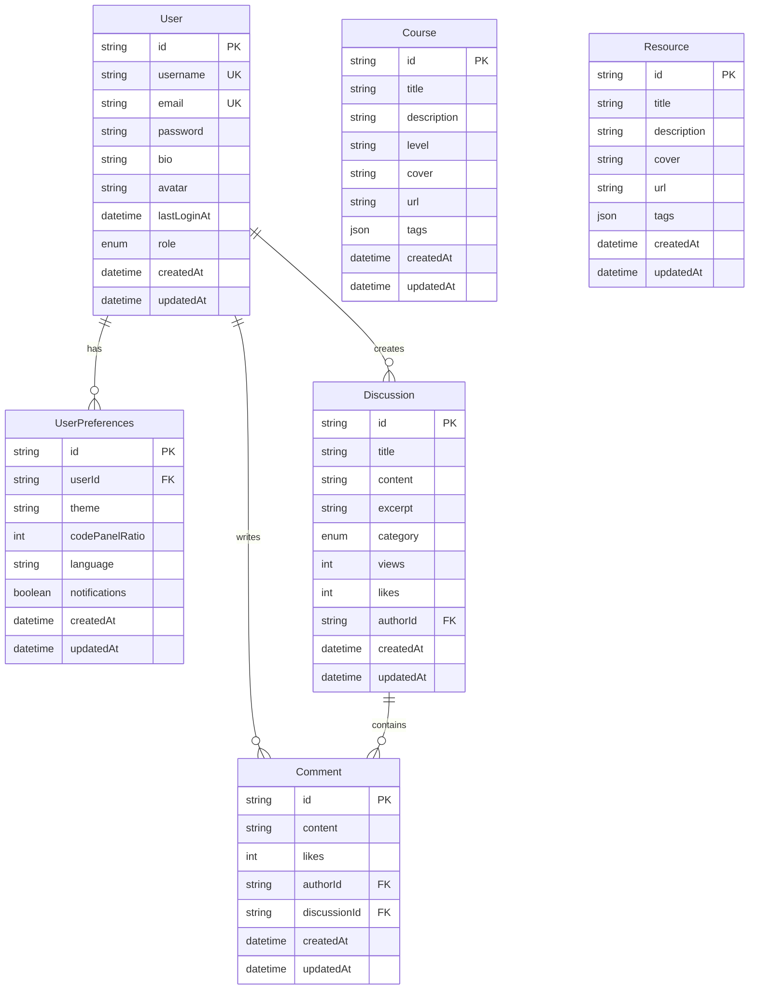

# 数据库设计文档

## 概述

AI学习平台采用Prisma ORM进行数据库操作，支持SQLite（开发环境）和PostgreSQL（生产环境）。数据库设计遵循关系型数据库范式，确保数据一致性和查询性能。

## 数据库架构

### 技术选型
- **ORM**: Prisma 6.14.0
- **开发数据库**: SQLite 3
- **生产数据库**: PostgreSQL 14+
- **迁移工具**: Prisma Migrate
- **客户端生成**: Prisma Client

### 配置文件

```prisma
// prisma/schema.prisma
generator client {
  provider = "prisma-client-js"
  output   = "../generated/prisma"
}

datasource db {
  provider = "sqlite"
  url      = "file:./dev.db"
}
```

## 数据模型设计

### 1. 用户模型 (User)

```prisma
model User {
  id          String    @id @default(cuid())
  username    String    @unique
  email       String    @unique
  password    String
  bio         String?
  avatar      String?
  lastLoginAt DateTime? @map("last_login_at")
  role        UserRole  @default(USER)
  createdAt   DateTime  @default(now()) @map("created_at")
  updatedAt   DateTime  @updatedAt @map("updated_at")
  
  // 关联关系
  userPreferences UserPreferences?
  discussions     Discussion[]
  comments        Comment[]
  
  @@map("users")
  @@index([email])
  @@index([username])
}
```

**字段说明**:
- `id`: 主键，使用CUID生成唯一标识
- `username`: 用户名，唯一索引
- `email`: 邮箱地址，唯一索引
- `password`: 加密后的密码
- `bio`: 个人简介，可选
- `avatar`: 头像URL，可选
- `lastLoginAt`: 最后登录时间，可选
- `role`: 用户角色枚举
- `createdAt`: 创建时间
- `updatedAt`: 更新时间

**索引设计**:
- 主键索引：`id`
- 唯一索引：`username`, `email`
- 查询索引：`email`, `username`

### 2. 用户偏好设置模型 (UserPreferences)

```prisma
model UserPreferences {
  id             String @id @default(cuid())
  userId         String @unique @map("user_id")
  theme          String @default("dark")
  codePanelRatio Int    @default(50) @map("code_panel_ratio")
  language       String @default("javascript")
  notifications  Boolean @default(true)
  createdAt      DateTime @default(now()) @map("created_at")
  updatedAt      DateTime @updatedAt @map("updated_at")
  
  // 关联关系
  user User @relation(fields: [userId], references: [id], onDelete: Cascade)
  
  @@map("user_preferences")
}
```

**字段说明**:
- `id`: 主键
- `userId`: 用户ID，外键关联User表
- `theme`: 主题设置（light/dark）
- `codePanelRatio`: 代码面板比例（0-100）
- `language`: 默认编程语言
- `notifications`: 是否启用通知
- `createdAt`: 创建时间
- `updatedAt`: 更新时间

### 3. 社区讨论模型 (Discussion)

```prisma
model Discussion {
  id        String              @id @default(cuid())
  title     String
  content   String
  excerpt   String
  category  DiscussionCategory
  views     Int                 @default(0)
  likes     Int                 @default(0)
  authorId  String              @map("author_id")
  createdAt DateTime            @default(now()) @map("created_at")
  updatedAt DateTime            @updatedAt @map("updated_at")
  
  // 关联关系
  author   User      @relation(fields: [authorId], references: [id], onDelete: Cascade)
  comments Comment[]
  
  @@map("discussions")
  @@index([authorId])
  @@index([category])
  @@index([createdAt])
  @@index([views])
  @@index([likes])
}
```

**字段说明**:
- `id`: 主键
- `title`: 讨论标题
- `content`: 讨论内容（Markdown格式）
- `excerpt`: 内容摘要
- `category`: 讨论分类枚举
- `views`: 浏览次数
- `likes`: 点赞数
- `authorId`: 作者ID，外键
- `createdAt`: 创建时间
- `updatedAt`: 更新时间

**索引设计**:
- 主键索引：`id`
- 外键索引：`authorId`
- 分类索引：`category`
- 时间索引：`createdAt`
- 排序索引：`views`, `likes`

### 4. 评论模型 (Comment)

```prisma
model Comment {
  id            String   @id @default(cuid())
  content       String
  likes         Int      @default(0)
  authorId      String   @map("author_id")
  discussionId  String   @map("discussion_id")
  createdAt     DateTime @default(now()) @map("created_at")
  updatedAt     DateTime @updatedAt @map("updated_at")
  
  // 关联关系
  author      User       @relation(fields: [authorId], references: [id], onDelete: Cascade)
  discussion  Discussion @relation(fields: [discussionId], references: [id], onDelete: Cascade)
  
  @@map("comments")
  @@index([authorId])
  @@index([discussionId])
  @@index([createdAt])
}
```

**字段说明**:
- `id`: 主键
- `content`: 评论内容
- `likes`: 点赞数
- `authorId`: 评论者ID，外键
- `discussionId`: 讨论ID，外键
- `createdAt`: 创建时间
- `updatedAt`: 更新时间

### 5. 课程模型 (Course)

```prisma
model Course {
  id          String   @id @default(cuid())
  title       String
  description String?
  level       String?
  cover       String?
  url         String
  tags        Json?
  createdAt   DateTime @default(now()) @map("created_at")
  updatedAt   DateTime @updatedAt @map("updated_at")

  @@map("courses")
  @@index([level])
  @@index([createdAt])
}
```

**字段说明**:
- `id`: 主键
- `title`: 课程标题
- `description`: 课程描述
- `level`: 课程难度级别
- `cover`: 封面图片URL
- `url`: 课程链接
- `tags`: 标签（JSON格式）
- `createdAt`: 创建时间
- `updatedAt`: 更新时间

### 6. 资源模型 (Resource)

```prisma
model Resource {
  id          String   @id @default(cuid())
  title       String
  description String?
  cover       String?
  url         String
  tags        Json?
  createdAt   DateTime @default(now()) @map("created_at")
  updatedAt   DateTime @updatedAt @map("updated_at")

  @@map("resources")
  @@index([createdAt])
}
```

**字段说明**:
- `id`: 主键
- `title`: 资源标题
- `description`: 资源描述
- `cover`: 封面图片URL
- `url`: 资源链接
- `tags`: 标签（JSON格式）
- `createdAt`: 创建时间
- `updatedAt`: 更新时间

## 枚举类型定义

```prisma
// 用户角色枚举
enum UserRole {
  USER
  ADMIN
  MODERATOR
}

// 学习进度状态枚举
enum ProgressStatus {
  NOT_STARTED
  IN_PROGRESS
  COMPLETED
  SKIPPED
}

// 讨论分类枚举
enum DiscussionCategory {
  TECH        // 技术讨论
  EXPERIENCE  // 经验分享
  PROJECT     // 项目展示
  HELP        // 求助问答
}
```

## 关系图



## 数据库操作示例

### 1. 用户相关操作

```typescript
// 创建用户
const createUser = async (userData: {
  username: string
  email: string
  password: string
}) => {
  const hashedPassword = await bcrypt.hash(userData.password, 12)
  
  return await prisma.user.create({
    data: {
      ...userData,
      password: hashedPassword,
      userPreferences: {
        create: {
          theme: 'dark',
          codePanelRatio: 50,
          language: 'javascript',
          notifications: true
        }
      }
    },
    include: {
      userPreferences: true
    }
  })
}

// 获取用户信息
const getUserById = async (userId: string) => {
  return await prisma.user.findUnique({
    where: { id: userId },
    include: {
      userPreferences: true,
      _count: {
        select: {
          discussions: true,
          comments: true
        }
      }
    }
  })
}

// 更新用户偏好
const updateUserPreferences = async (
  userId: string,
  preferences: Partial<UserPreferences>
) => {
  return await prisma.userPreferences.update({
    where: { userId },
    data: preferences
  })
}
```

### 2. 社区相关操作

```typescript
// 创建讨论
const createDiscussion = async (discussionData: {
  title: string
  content: string
  category: DiscussionCategory
  authorId: string
}) => {
  // 生成摘要
  const excerpt = discussionData.content.substring(0, 200) + '...'
  
  return await prisma.discussion.create({
    data: {
      ...discussionData,
      excerpt
    },
    include: {
      author: {
        select: {
          id: true,
          username: true,
          avatar: true
        }
      }
    }
  })
}

// 获取讨论列表（分页）
const getDiscussions = async (params: {
  page: number
  limit: number
  category?: DiscussionCategory
  sortBy?: 'createdAt' | 'views' | 'likes'
  sortOrder?: 'asc' | 'desc'
}) => {
  const { page, limit, category, sortBy = 'createdAt', sortOrder = 'desc' } = params
  const skip = (page - 1) * limit
  
  const where = category ? { category } : {}
  
  const [discussions, total] = await Promise.all([
    prisma.discussion.findMany({
      where,
      skip,
      take: limit,
      include: {
        author: {
          select: {
            id: true,
            username: true,
            avatar: true
          }
        },
        _count: {
          select: { comments: true }
        }
      },
      orderBy: { [sortBy]: sortOrder }
    }),
    prisma.discussion.count({ where })
  ])
  
  return {
    discussions,
    pagination: {
      page,
      limit,
      total,
      totalPages: Math.ceil(total / limit)
    }
  }
}

// 添加评论
const addComment = async (commentData: {
  content: string
  authorId: string
  discussionId: string
}) => {
  return await prisma.comment.create({
    data: commentData,
    include: {
      author: {
        select: {
          id: true,
          username: true,
          avatar: true
        }
      }
    }
  })
}
```

### 3. 课程和资源操作

```typescript
// 获取课程列表
const getCourses = async (params: {
  page: number
  limit: number
  level?: string
  tags?: string[]
}) => {
  const { page, limit, level, tags } = params
  const skip = (page - 1) * limit
  
  const where: any = {}
  if (level) where.level = level
  if (tags && tags.length > 0) {
    where.tags = {
      path: [],
      string_contains: tags.join(',')
    }
  }
  
  const [courses, total] = await Promise.all([
    prisma.course.findMany({
      where,
      skip,
      take: limit,
      orderBy: { createdAt: 'desc' }
    }),
    prisma.course.count({ where })
  ])
  
  return {
    courses,
    pagination: {
      page,
      limit,
      total,
      totalPages: Math.ceil(total / limit)
    }
  }
}

// 搜索功能
const searchContent = async (query: string, type: 'all' | 'courses' | 'resources' | 'discussions') => {
  const searchResults = {}
  
  if (type === 'all' || type === 'courses') {
    searchResults.courses = await prisma.course.findMany({
      where: {
        OR: [
          { title: { contains: query } },
          { description: { contains: query } }
        ]
      },
      take: 10
    })
  }
  
  if (type === 'all' || type === 'resources') {
    searchResults.resources = await prisma.resource.findMany({
      where: {
        OR: [
          { title: { contains: query } },
          { description: { contains: query } }
        ]
      },
      take: 10
    })
  }
  
  if (type === 'all' || type === 'discussions') {
    searchResults.discussions = await prisma.discussion.findMany({
      where: {
        OR: [
          { title: { contains: query } },
          { content: { contains: query } }
        ]
      },
      include: {
        author: {
          select: {
            id: true,
            username: true,
            avatar: true
          }
        }
      },
      take: 10
    })
  }
  
  return searchResults
}
```

## 数据库迁移

### 1. 初始化迁移

```bash
# 生成Prisma客户端
npx prisma generate

# 创建初始迁移
npx prisma migrate dev --name init

# 应用迁移到数据库
npx prisma migrate deploy
```

### 2. 数据库种子

```typescript
// prisma/seed.ts
import { PrismaClient } from '@prisma/client'
import bcrypt from 'bcryptjs'

const prisma = new PrismaClient()

async function main() {
  // 创建管理员用户
  const adminPassword = await bcrypt.hash('admin123', 12)
  const admin = await prisma.user.upsert({
    where: { email: 'admin@example.com' },
    update: {},
    create: {
      username: 'admin',
      email: 'admin@example.com',
      password: adminPassword,
      role: 'ADMIN',
      userPreferences: {
        create: {
          theme: 'dark',
          codePanelRatio: 50,
          language: 'typescript',
          notifications: true
        }
      }
    }
  })
  
  console.log('Created admin user:', admin)
  
  // 创建示例课程
  const courses = [
    {
      title: 'Vue 3 基础教程',
      description: '从零开始学习Vue 3框架',
      level: 'beginner',
      url: 'https://example.com/vue3-basics',
      tags: ['vue', 'frontend', 'javascript']
    },
    {
      title: 'TypeScript 进阶',
      description: '深入学习TypeScript高级特性',
      level: 'intermediate',
      url: 'https://example.com/typescript-advanced',
      tags: ['typescript', 'javascript', 'backend']
    }
  ]
  
  for (const course of courses) {
    await prisma.course.create({ data: course })
  }
  
  console.log('Created sample courses')
  
  // 创建示例讨论
  const discussions = [
    {
      title: 'Vue 3 vs React 18 对比',
      content: '我想了解一下Vue 3和React 18的主要区别...',
      category: 'TECH' as const,
      authorId: admin.id
    },
    {
      title: '我的第一个全栈项目经验分享',
      content: '最近完成了我的第一个全栈项目，想分享一下经验...',
      category: 'EXPERIENCE' as const,
      authorId: admin.id
    }
  ]
  
  for (const discussion of discussions) {
    await prisma.discussion.create({
      data: {
        ...discussion,
        excerpt: discussion.content.substring(0, 200) + '...'
      }
    })
  }
  
  console.log('Created sample discussions')
}

main()
  .catch((e) => {
    console.error(e)
    process.exit(1)
  })
  .finally(async () => {
    await prisma.$disconnect()
  })
```

### 3. 迁移脚本

```typescript
// scripts/migrate.ts
import { PrismaClient } from '@prisma/client'
import { execSync } from 'child_process'

const prisma = new PrismaClient()

async function migrate() {
  try {
    console.log('🔄 Starting database migration...')
    
    // 生成Prisma客户端
    console.log('📦 Generating Prisma client...')
    execSync('npx prisma generate', { stdio: 'inherit' })
    
    // 推送数据库schema
    console.log('🗄️  Pushing database schema...')
    execSync('npx prisma db push', { stdio: 'inherit' })
    
    // 运行种子数据
    console.log('🌱 Running seed data...')
    execSync('npx ts-node prisma/seed.ts', { stdio: 'inherit' })
    
    console.log('✅ Migration completed successfully!')
  } catch (error) {
    console.error('❌ Migration failed:', error)
    process.exit(1)
  } finally {
    await prisma.$disconnect()
  }
}

migrate()
```

## 性能优化

### 1. 索引策略

```sql
-- 用户表索引
CREATE INDEX idx_users_email ON users(email);
CREATE INDEX idx_users_username ON users(username);
CREATE INDEX idx_users_role ON users(role);
CREATE INDEX idx_users_created_at ON users(created_at);

-- 讨论表索引
CREATE INDEX idx_discussions_author_id ON discussions(author_id);
CREATE INDEX idx_discussions_category ON discussions(category);
CREATE INDEX idx_discussions_created_at ON discussions(created_at);
CREATE INDEX idx_discussions_views ON discussions(views);
CREATE INDEX idx_discussions_likes ON discussions(likes);

-- 评论表索引
CREATE INDEX idx_comments_author_id ON comments(author_id);
CREATE INDEX idx_comments_discussion_id ON comments(discussion_id);
CREATE INDEX idx_comments_created_at ON comments(created_at);

-- 课程表索引
CREATE INDEX idx_courses_level ON courses(level);
CREATE INDEX idx_courses_created_at ON courses(created_at);

-- 资源表索引
CREATE INDEX idx_resources_created_at ON resources(created_at);
```

### 2. 查询优化

```typescript
// 使用select减少数据传输
const getDiscussionList = async (page: number, limit: number) => {
  return await prisma.discussion.findMany({
    skip: (page - 1) * limit,
    take: limit,
    select: {
      id: true,
      title: true,
      excerpt: true,
      category: true,
      views: true,
      likes: true,
      createdAt: true,
      author: {
        select: {
          id: true,
          username: true,
          avatar: true
        }
      },
      _count: {
        select: { comments: true }
      }
    },
    orderBy: { createdAt: 'desc' }
  })
}

// 批量操作优化
const getUsersByIds = async (userIds: string[]) => {
  return await prisma.user.findMany({
    where: { id: { in: userIds } },
    select: {
      id: true,
      username: true,
      email: true,
      avatar: true
    }
  })
}

// 聚合查询优化
const getDiscussionStats = async (authorId: string) => {
  return await prisma.discussion.aggregate({
    where: { authorId },
    _count: { id: true },
    _sum: { views: true, likes: true },
    _avg: { views: true }
  })
}
```

### 3. 连接池配置

```typescript
// config/database.ts
import { PrismaClient } from '@prisma/client'

export const prisma = new PrismaClient({
  datasources: {
    db: {
      url: process.env.DATABASE_URL
    }
  },
  log: process.env.NODE_ENV === 'development' ? ['query', 'error', 'warn'] : ['error'],
  // 连接池配置（PostgreSQL）
  // (SQLite不支持连接池)
  __internal: {
    engine: {
      connectionLimit: 10,
      poolTimeout: 10000
    }
  }
})
```

## 备份与恢复

### 1. SQLite备份

```bash
# 备份数据库
cp prisma/dev.db backups/dev-$(date +%Y%m%d-%H%M%S).db

# 压缩备份
gzip backups/dev-$(date +%Y%m%d-%H%M%S).db

# 恢复数据库
cp backups/dev-20231201-120000.db prisma/dev.db
```

### 2. PostgreSQL备份

```bash
# 备份数据库
pg_dump -h localhost -U username -d database_name > backup.sql

# 恢复数据库
psql -h localhost -U username -d database_name < backup.sql

# 压缩备份
pg_dump -h localhost -U username -d database_name | gzip > backup.sql.gz
```

### 3. 自动备份脚本

```typescript
// scripts/backup.ts
import fs from 'fs'
import path from 'path'
import { execSync } from 'child_process'

const backupDir = path.join(process.cwd(), 'backups')
const timestamp = new Date().toISOString().replace(/[:.]/g, '-')

async function createBackup() {
  try {
    // 确保备份目录存在
    if (!fs.existsSync(backupDir)) {
      fs.mkdirSync(backupDir, { recursive: true })
    }
    
    const dbProvider = process.env.DB_PROVIDER || 'sqlite'
    
    if (dbProvider === 'sqlite') {
      // SQLite备份
      const sourceFile = 'prisma/dev.db'
      const backupFile = path.join(backupDir, `dev-${timestamp}.db`)
      
      fs.copyFileSync(sourceFile, backupFile)
      
      // 压缩备份
      execSync(`gzip ${backupFile}`)
      
      console.log(`✅ SQLite backup created: ${backupFile}.gz`)
    } else if (dbProvider === 'postgresql') {
      // PostgreSQL备份
      const backupFile = path.join(backupDir, `pg-${timestamp}.sql`)
      const dbUrl = process.env.DATABASE_URL!
      
      execSync(`pg_dump "${dbUrl}" > ${backupFile}`)
      
      // 压缩备份
      execSync(`gzip ${backupFile}`)
      
      console.log(`✅ PostgreSQL backup created: ${backupFile}.gz`)
    }
    
    // 清理旧备份（保留最近7天）
    await cleanupOldBackups()
    
  } catch (error) {
    console.error('❌ Backup failed:', error)
    throw error
  }
}

async function cleanupOldBackups() {
  const files = fs.readdirSync(backupDir)
  const now = Date.now()
  const sevenDaysAgo = now - (7 * 24 * 60 * 60 * 1000)
  
  for (const file of files) {
    const filePath = path.join(backupDir, file)
    const stats = fs.statSync(filePath)
    
    if (stats.mtime.getTime() < sevenDaysAgo) {
      fs.unlinkSync(filePath)
      console.log(`🗑️  Deleted old backup: ${file}`)
    }
  }
}

createBackup()
```

## 监控与维护

### 1. 数据库健康检查

```typescript
// utils/dbHealth.ts
import { prisma } from '../config/database'

export const checkDatabaseHealth = async () => {
  try {
    // 测试数据库连接
    await prisma.$queryRaw`SELECT 1`
    
    // 检查表是否存在
    const tables = await prisma.$queryRaw<Array<{ name: string }>>`
      SELECT name FROM sqlite_master 
      WHERE type='table' AND name NOT LIKE 'sqlite_%'
    `
    
    // 检查记录数
    const stats = await Promise.all([
      prisma.user.count(),
      prisma.discussion.count(),
      prisma.comment.count(),
      prisma.course.count(),
      prisma.resource.count()
    ])
    
    return {
      status: 'healthy',
      tables: tables.length,
      stats: {
        users: stats[0],
        discussions: stats[1],
        comments: stats[2],
        courses: stats[3],
        resources: stats[4]
      }
    }
  } catch (error) {
    return {
      status: 'unhealthy',
      error: error instanceof Error ? error.message : 'Unknown error'
    }
  }
}
```

### 2. 性能监控

```typescript
// utils/dbPerformance.ts
export const monitorQueryPerformance = async () => {
  const queries = [
    'SELECT COUNT(*) FROM users',
    'SELECT COUNT(*) FROM discussions',
    'SELECT COUNT(*) FROM comments'
  ]
  
  const results = []
  
  for (const query of queries) {
    const start = Date.now()
    await prisma.$queryRawUnsafe(query)
    const duration = Date.now() - start
    
    results.push({
      query,
      duration: `${duration}ms`
    })
  }
  
  return results
}
```

## 安全考虑

### 1. 数据加密

```typescript
// 敏感数据加密
import crypto from 'crypto'

const encryptSensitiveData = (data: string): string => {
  const algorithm = 'aes-256-gcm'
  const key = crypto.scryptSync(process.env.ENCRYPTION_KEY!, 'salt', 32)
  const iv = crypto.randomBytes(16)
  
  const cipher = crypto.createCipher(algorithm, key, iv)
  
  let encrypted = cipher.update(data, 'utf8', 'hex')
  encrypted += cipher.final('hex')
  
  const authTag = cipher.getAuthTag()
  
  return iv.toString('hex') + ':' + authTag.toString('hex') + ':' + encrypted
}

const decryptSensitiveData = (encryptedData: string): string => {
  const algorithm = 'aes-256-gcm'
  const key = crypto.scryptSync(process.env.ENCRYPTION_KEY!, 'salt', 32)
  
  const parts = encryptedData.split(':')
  const iv = Buffer.from(parts[0], 'hex')
  const authTag = Buffer.from(parts[1], 'hex')
  const encrypted = parts[2]
  
  const decipher = crypto.createDecipher(algorithm, key, iv)
  decipher.setAuthTag(authTag)
  
  let decrypted = decipher.update(encrypted, 'hex', 'utf8')
  decrypted += decipher.final('utf8')
  
  return decrypted
}
```

### 2. 访问控制

```typescript
// 数据访问权限控制
export const checkDataAccess = async (userId: string, resourceType: string, resourceId: string) => {
  const user = await prisma.user.findUnique({
    where: { id: userId },
    select: { role: true }
  })
  
  if (!user) return false
  
  // 管理员可以访问所有资源
  if (user.role === 'ADMIN') return true
  
  // 检查资源所有权
  switch (resourceType) {
    case 'discussion':
      const discussion = await prisma.discussion.findUnique({
        where: { id: resourceId },
        select: { authorId: true }
      })
      return discussion?.authorId === userId
      
    case 'comment':
      const comment = await prisma.comment.findUnique({
        where: { id: resourceId },
        select: { authorId: true }
      })
      return comment?.authorId === userId
      
    default:
      return false
  }
}
```

---

**文档版本**: v1.0.0  
**最后更新**: 2026-01-06  
**维护团队**: AI Learning Platform Team
