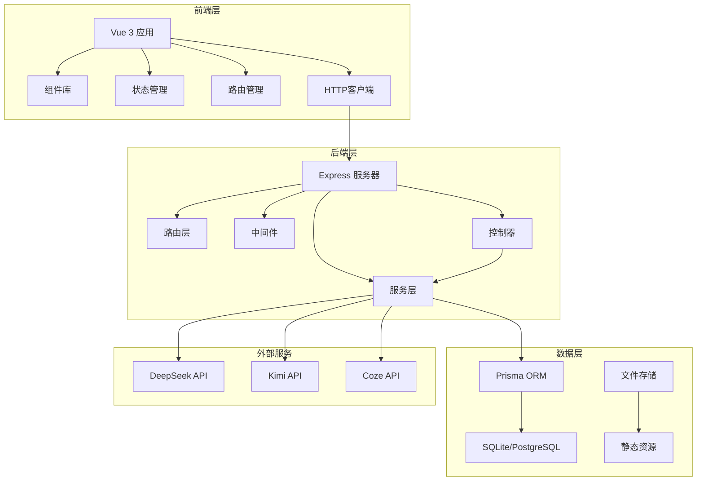
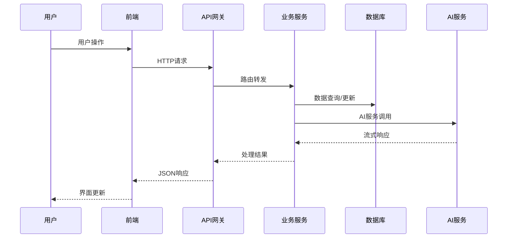

# AI学习平台 - 项目概述

## 项目简介

AI学习平台是一个现代化的全栈Web应用，旨在为用户提供AI驱动的学习体验。平台集成了多种AI服务（DeepSeek、Kimi、Coze等），提供课程学习、资源管理、社区讨论等功能，采用前后端分离架构设计。

## 核心特性

### 🤖 AI集成能力
- **多AI服务支持**：集成DeepSeek、Kimi、Coze等主流AI服务
- **智能代码助手**：基于Monaco Editor的代码编辑器，支持AI辅助编程
- **流式响应处理**：实时显示AI生成内容，提升用户体验
- **功能开关控制**：支持灵活的AI功能启用/禁用配置

### 📚 学习管理
- **课程系统**：结构化的课程内容管理
- **资源库**：丰富的学习资源分类和检索
- **进度跟踪**：学习进度可视化管理
- **个性化推荐**：基于用户行为的内容推荐

### 👥 社区功能
- **讨论区**：技术交流、经验分享、项目展示、求助问答
- **评论系统**：支持点赞和回复的互动机制
- **用户主页**：个人资料展示和学习历程
- **关注系统**：用户间关注和消息通知

### 🎨 用户体验
- **响应式设计**：适配桌面端和移动端
- **主题切换**：支持明暗主题自由切换
- **国际化支持**：多语言界面（中英文）
- **无障碍访问**：符合Web可访问性标准

## 技术架构

### 前端技术栈
```
Vue 3.5.18          # 渐进式JavaScript框架
TypeScript 5.9.2    # JavaScript超集，提供类型安全
Vite 7.0.4          # 现代化前端构建工具
Element Plus 2.10.7 # Vue 3组件库
Pinia 3.0.3         # Vue状态管理库
Vue Router 4.5.1    # Vue官方路由管理器
TailwindCSS 3.4.4   # 实用优先的CSS框架
Monaco Editor 0.50.0 # 代码编辑器组件
Axios 1.11.0        # HTTP客户端库
```

### 后端技术栈
```
Node.js             # JavaScript运行时
Express 5.1.0       # Web应用框架
TypeScript 5.9.2    # 类型安全的JavaScript
Prisma 6.14.0       # 现代化数据库ORM
SQLite3 5.1.7       # 轻量级数据库（开发环境）
JWT 9.0.2           # JSON Web Token认证
bcryptjs 3.0.2      # 密码加密库
CORS 2.8.5          # 跨域资源共享
```

### 开发工具
```
Vitest 3.2.4        # 单元测试框架
ESLint              # 代码质量检查
Prettier            # 代码格式化
Concurrently 9.2.1  # 并发进程管理
Nodemon 3.0.0       # 开发时自动重启
```

## 系统架构图



## 项目结构

```
ai-learning-platform(vue)/
├── client/                 # 前端应用
│   ├── src/
│   │   ├── components/     # 可复用组件
│   │   ├── pages/         # 页面组件
│   │   ├── services/      # 业务服务
│   │   ├── stores/        # 状态管理
│   │   ├── router/        # 路由配置
│   │   ├── types/         # 类型定义
│   │   └── utils/         # 工具函数
│   ├── public/            # 静态资源
│   └── dist/              # 构建产物
├── server/                 # 后端应用
│   ├── src/
│   │   ├── controllers/   # 控制器
│   │   ├── routes/        # 路由定义
│   │   ├── services/      # 业务服务
│   │   ├── middleware/    # 中间件
│   │   └── models/        # 数据模型
│   ├── prisma/            # 数据库配置
│   ├── config/            # 配置文件
│   └── dist/              # 构建产物
├── shared/                 # 共享代码
├── docs/                   # 项目文档
└── scripts/                # 构建脚本
```

## 核心功能模块

### 1. 用户认证模块
- 用户注册/登录
- JWT令牌管理
- 密码加密存储
- 权限角色控制

### 2. 课程管理模块
- 课程CRUD操作
- 章节内容管理
- 学习进度跟踪
- 课程分类标签

### 3. 资源管理模块
- 学习资源上传
- 资源分类检索
- 资源评分系统
- 资源推荐算法

### 4. 社区讨论模块
- 帖子发布管理
- 评论回复系统
- 点赞收藏功能
- 内容审核机制

### 5. AI服务模块
- 多AI接口集成
- 流式响应处理
- 上下文管理
- 错误重试机制

## 数据流架构



## 安全特性

### 认证授权
- JWT令牌认证
- 角色权限控制
- API访问限制
- 会话管理

### 数据安全
- 密码bcrypt加密
- SQL注入防护
- XSS攻击防护
- CSRF令牌验证

### 网络安全
- HTTPS传输加密
- CORS跨域控制
- 请求频率限制
- 输入数据验证

## 性能优化

### 前端优化
- 组件懒加载
- 路由懒加载
- 图片懒加载
- 代码分割打包

### 后端优化
- 数据库索引优化
- 查询结果缓存
- 连接池管理
- 响应压缩

### 部署优化
- CDN静态资源
- 负载均衡
- 容器化部署
- 监控告警

## 开发规范

### 代码规范
- TypeScript严格模式
- ESLint代码检查
- Prettier代码格式化
- Git提交规范

### 测试规范
- 单元测试覆盖
- 集成测试验证
- E2E测试自动化
- 性能测试基准

### 文档规范
- API接口文档
- 代码注释规范
- 变更日志维护
- 部署文档更新

## 版本规划

### v1.0.0 (当前版本)
- ✅ 基础功能实现
- ✅ 用户系统完善
- ✅ AI服务集成
- ✅ 社区功能上线

### v1.1.0 (计划中)
- 🔄 移动端适配
- 🔄 实时通知系统
- 🔄 高级搜索功能
- 🔄 数据分析面板

### v2.0.0 (未来版本)
- 📋 微服务架构
- 📋 多租户支持
- 📋 插件系统
- 📋 国际化完善

---

**文档版本**: v1.0.0  
**最后更新**: 2026-01-06  
**维护团队**: AI Learning Platform Team
